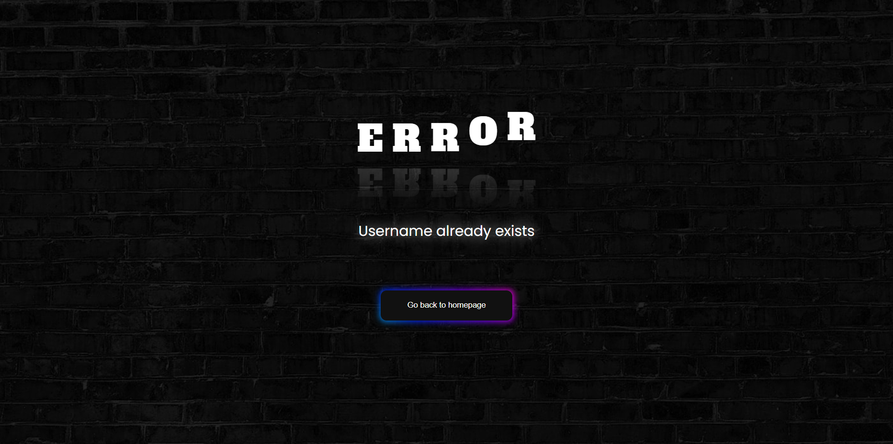
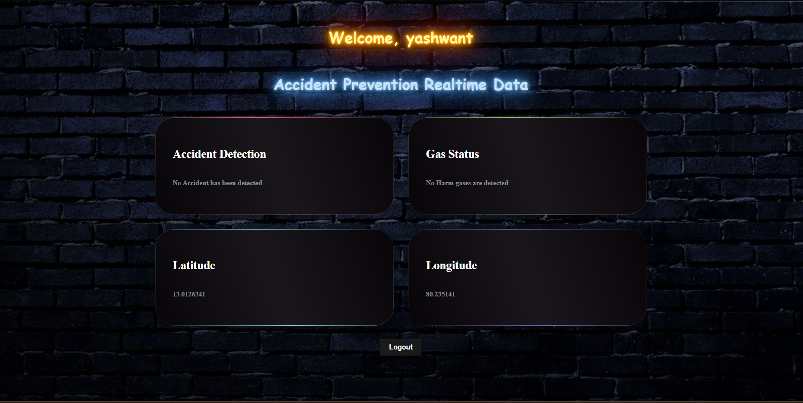

# 🚑 IoT-Based Road Accident Detection and Emergency Response System

This project integrates **IoT sensors** and a **Node.js-based backend** to detect road accidents and notify hospitals in real-time. It ensures timely medical aid through rapid alerting and live status tracking.

---

## 📌 Features

### 🖥️ Web (Node.js + Express + SQLite)
- User Registration and Login System with session management.
- Dashboard to display authenticated user info.
- EJS templating engine used for dynamic content.
- Stores user data in SQLite.
- Error handling and success feedback through rendered views.

### 🚗 IoT Accident Detection System
- **MEMS sensors** in vehicles continuously monitor motion.
- Upon detecting abnormal patterns (like a crash), an alert is triggered.
- Alerts sent to a centralized server with location (lat, long) and gas stats.
- Hospitals use a dedicated web interface to respond to alerts.

---

## 🏗️ Tech Stack

| Component          | Technology                  |
|------------------- |-----------------------------|
| Backend            | Node.js, Express.js         |
| Database           | SQLite                      |
| Frontend (Web)     | HTML, CSS, EJS              |
| Session Handling   | express-session             |
| Sensor Hardware    | MEMS Accelerometer + IoT    |
| Mobile App         | Firebase, Google Maps       |

---

## 🔧 Setup Instructions

### Prerequisites
- Node.js installed
- SQLite3 installed

### Steps

1. **Clone the Repository**
   git clone https://github.com/your-username/iot-accident-detection.git
   cd iot-accident-detection

2. **Install Dependencies**
    npm install

3. **Run the Server**
    node app.js

4. **Visit**
    Open your browser at: http://localhost:3000

🧪 Usage
Register at /register

Login from /

On successful login, view the dashboard at /dashboard

Logout from /logout

The IoT hardware sends data to the backend server, which then logs and analyzes it. On detecting an accident, an emergency alert is triggered and the hospital is notified.

